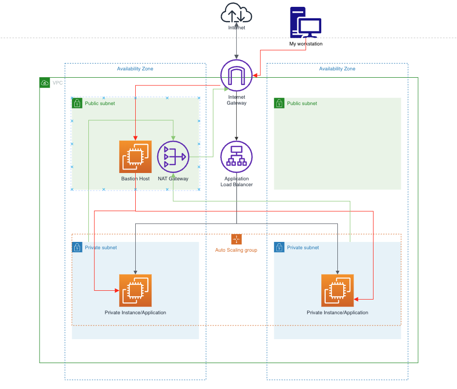

# terraform-aws-vpc-bastion

A Terraform build of a production-style AWS network foundation: a multi-AZ VPC with public/private subnet isolation, an Application Load Balancer serving a Python web app on private Auto Scaling Group instances, and a bastion host as the only SSH entry point into the environment. Modeled on AWS's [reference private-subnet/NAT architecture](https://docs.aws.amazon.com/vpc/latest/userguide/vpc-example-private-subnets-nat.html).

## Architecture



- A VPC spans two Availability Zones, each with a public and a private subnet.
- The **Application Load Balancer** sits in both public subnets and is the only way application traffic reaches the private instances.
- A single **NAT Gateway** (a deliberate cost tradeoff over one-per-AZ) gives the private subnets outbound-only internet access.
- A **bastion host** in the public subnet is the sole SSH entry point; from there, [SSH agent forwarding](https://crishantha.medium.com/handing-bastion-hosts-on-aws-via-ssh-agent-forwarding-f1d2d4e8622a) is used to reach the private application instances without ever storing private keys on the bastion itself.
- Security groups are scoped by reference, not open CIDR ranges: the app instances only accept port 8000 from the ALB's security group and port 22 from the bastion's security group.

## Prerequisites

- [Terraform](https://developer.hashicorp.com/terraform/downloads) (tested with v1.15)
- An AWS account with credentials configured (`aws configure` or environment variables)
- An SSH key pair for bastion access:
  ```bash
  ssh-keygen -t ed25519 -f ~/.ssh/tf-bastion
  ```

## Setup

1. Clone the repo and copy the example variables file:
   ```bash
   cp terraform.tfvars.example local.auto.tfvars
   ```
2. Edit `local.auto.tfvars` with your public IP and SSH key path (see comments in the file).
3. Initialize and deploy:
   ```bash
   terraform init
   terraform plan
   terraform apply
   ```
4. Grab the outputs:
   ```bash
   terraform output
   ```

## Testing the application

Open the ALB's DNS name in a browser or with curl:

```bash
curl http://$(terraform output -raw alb_dns_name)
```

## Accessing private instances via SSH

```bash
ssh-add ~/.ssh/tf-bastion
ssh -A ubuntu@$(terraform output -raw bastion_public_ip)

# from inside the bastion, agent forwarding lets you jump straight in:
ssh ubuntu@<private-instance-ip>
```

## Cleaning up

```bash
terraform destroy
```

## License

MIT — see [LICENSE](./LICENSE)